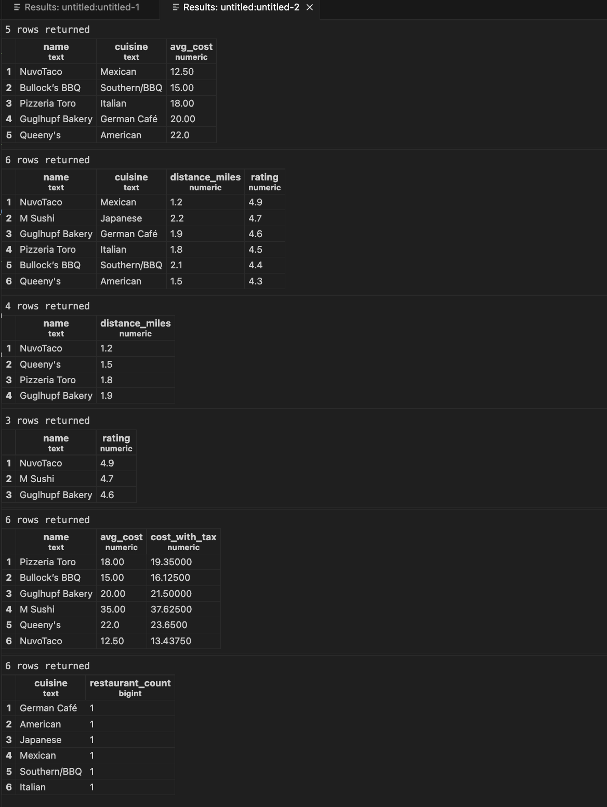

# IDS706_DE_Wk6_PostgreSQL-Exercise

*SQL Practice with PSQL or make you own static/interactive visualization*
- What are the 5 cheapest restaurants based on avg_cost?
- Which nearby restaurants (within 5 miles) are highly rated (4.0+)?
- Return name, distance_miles for restaurants within 2.0 miles, ordered by distance.
- Show the top 3 restaurants by rating (highest first).
- List name, avg_cost and cost with 7.5% tax as cost_with_tax.
- How many restaurants are there per cuisine, highest count first?

**Results from Running this queries above**

